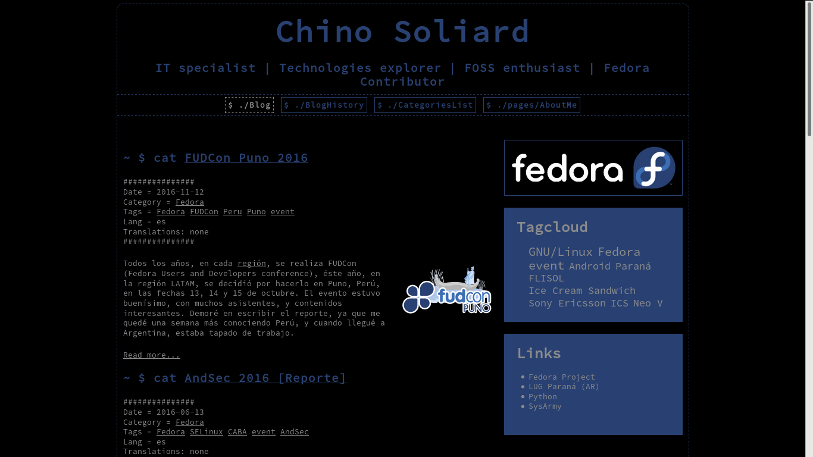

Pelican theme - responsive-cli-theme
================================

responsive-cli-theme
----------

responsive-cli-theme is a [pelican](https://www.getpelican.com) theme based on [Responsive Pelican theme](https://github.com/ir193/Responsive-Pelican/) and [Lightweight theme](https://github.com/getpelican/pelican-themes/tree/master/lightweight)

Screenshot
----------

  

ADSense
-------
You can use adsense with this template (in the posts you want). For this you must:  

  1. In the post(s) you want ads, add "adsense: 1" in the META area, as this sample:

    Title: MyTittle
    Date: 2017-03-30 9:00
    Category: Category
    Tags: Pelican, Theme
    Lang: en
    Slug: my-title
    adsense: 1

  2. Add your adsense codes, editting templates/adsense\*.html.
*NOTE:* if you don't edit adsense\*.html files, you probably use my codes, and give me your income :-P. If you think that 3 ads are many, you can save "empty" files.

